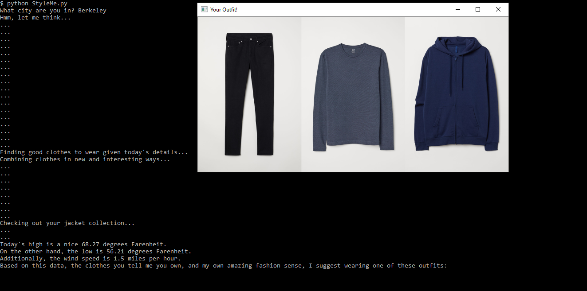
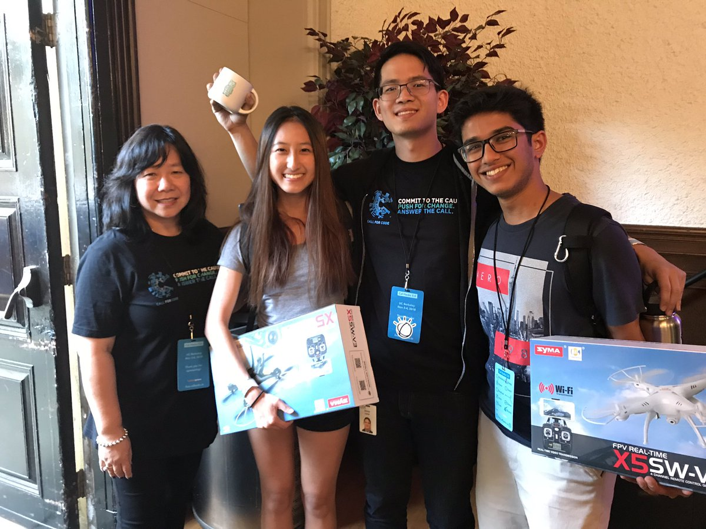
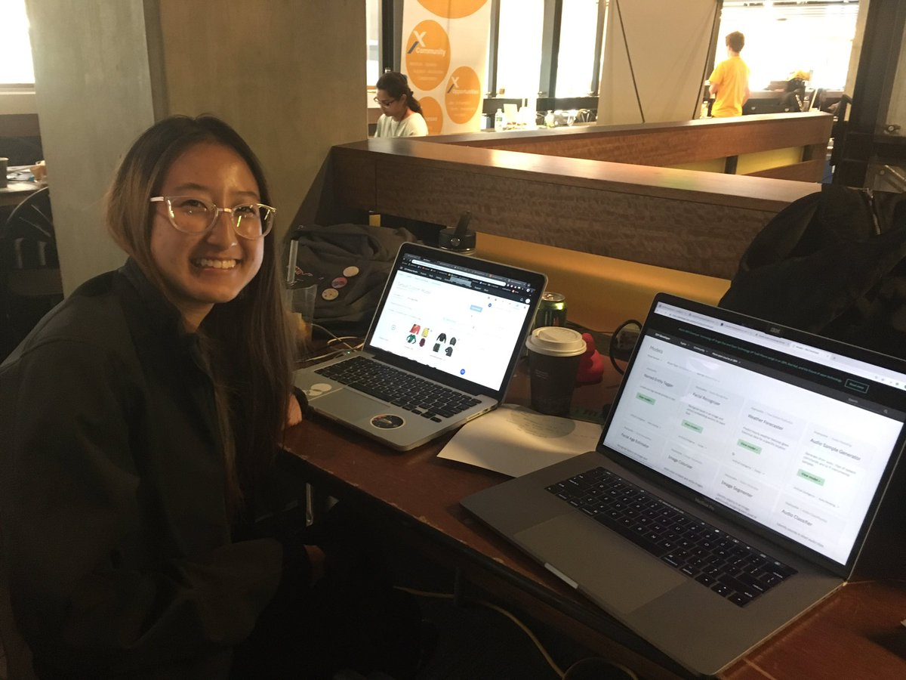

# StyleMe :shirt::jeans:
###### Created by Jacqueline Zhang and Sahil Sanghvi for CalHacks 5.0

### Introduction
We all have those days when we wake up and don't know what to wear. We want to be stylish, but we also don't have the time to stand there and contemplate about what tops would pair well with certain bottoms. In order to help reduce the indecisive moments we have regarding our outfit choices, **StyleMe** automatically generates outfit choices based on **items in your wardrobe** and environmental factors such as the **weather**.

### How To Use This
1. Upload photos of clothing into the```assets/images``` folder.
1. Run the Python script with this command in Terminal:
```python3 StyleMe.py```
1. User must input a valid city name when confronted with this prompt:
```What city are you in?```
1. Let the code run!
The output should look something like the following:


### How Does This Work
Using **IBM Watson's Vision Recognition API**, we created a **custom classifier** and trained it with over **1100 images**. These images were grouped by article of clothing, and a vast majority of images from different backgrounds, angles, etc. were included in order to maximize accuracy. 

We also used the **OpenWeatherMap API** to gather data about weather conditions in the specificied city that we are observing.

Combining the two, the Python script would filter through articles in your wardrobe based on weather conditions that day. The script matches outfit combinations, ensuring that each top is paired with a bottom and that outerwear is optional. It displays these outfit choices with **OpenCV2**. 

### Awards
In November 2018, StyleMe was tied for 1st place in the IBM API Challenge for CalHacks 5.0!


### What's Next?
Sahil and I have many floating ideas that we would **LOVE** to implement and/or expand on for StyleMe. Some of our ideas include, but are not limited to:
* Turning it into a web application (potentially through Meteor)
* Retraining the classifier to be more specific (fabrics, hooded vs non-hooded jackets, etc.)
* User being able to input an occassion and filtering outfits based on criteria related to that occassion
* Implementing a bot that reads the latest fashion trends and using that information to create stylish outfits
* Shopping recommendations based on what the user currently has in his/her wardrobe

